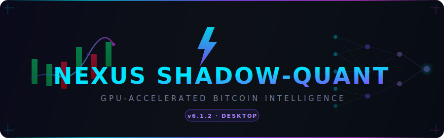
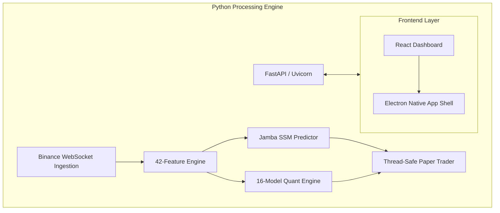

<div align="center">

<picture>
  <source media="(prefers-color-scheme: dark)" srcset="assets/logo-banner.svg">
  <source media="(prefers-color-scheme: light)" srcset="assets/logo-banner.svg">
  
</picture>

<br/>
<br/>

[](https://github.com/lukeedIII/Predictor)
[](https://python.org)
[](https://react.dev)
[](https://fastapi.tiangolo.com/)
[](https://electronjs.org)
[](https://developer.nvidia.com)
[](LICENSE)

> **Nexus Shadow-Quant** is an autonomous, institutional-grade Bitcoin intelligence suite.  
> It ingests live market data, runs a 16-model quant engine, and deploys a self-supervised  
> **Jamba Hybrid SSM** to forecast price direction — all running entirely locally on your machine.

</div>

---

## ✨ Execution at a Glance

| Capability | Detail |
|:-----------|:-------|
| 🧠 **Core Intelligence** | **Jamba Hybrid SSM** — Mamba selective state spaces + Attention + Mixture of Experts (MoE) |
| 🎯 **Prediction Target** | P(BTC up **≥ +0.30%** within 15 minutes) — 3-class (UP / FLAT / DOWN) |
| 📡 **Data Pipeline** | Zero-leakage Binance REST & WebSocket integration · 42 scale-invariant engineered features |
| 🔬 **Quant Engine** | 16 institutional models running synchronously (HMM, GJR-GARCH, PPO RL, TDA, RQA...) |
| 💹 **Paper Trading** | Long/short simulation · multi-position · Kelly sizing · robust fee-adjusted PnL |
| 🤖 **Dr. Nexus AI** | Native LLM analyst — OpenAI → Gemini → Ollama → 100% offline Qwen 0.5B fallback |
| 🖥️ **Premium Dashboard** | Electron + React · WebSocket push architecture · Glassmorphism · Multi-Layout support |

---

## 📸 Platform Overview

<div align="center">
  
  <p><em>Real-Time BTC Forecasting · Active Quant Intelligence Engine · Dr. Nexus AI Analyst</em></p>
</div>

---

## 🏛️ System Architecture

Nexus Shadow-Quant is split into a robust Python processing layer and an ultra-fast React presentation layer, bridging streams asynchronously via WebSockets.



> **100% Local Execution.** External telemetry is strictly limited to market data (Binance) and opt-in AI LLM backends (OpenAI/Gemini/HF).

---

## 🧬 Prediction Target Dynamics

This engine employs a highly deliberate class-target design, filtering out horizontal noise in favor of statistically significant momentum capture.

```text
Target Formulation (horizon=15m)
─────────────────────────────────
UP    = 1 : close[t+15] > close[t] × 1.003    (+0.30% momentum)
DOWN  = 0 : close[t+15] < close[t] × 0.997    (-0.30% momentum)
FLAT  = Dropped from loss calculation to eliminate pure random walk noise

* The 0.30% threshold precisely models taker fees + expected slippage, forcing the model to primarily signal mathematically executable setups.
```

---

## 🧠 The Jamba Hybrid SSM

Adapted from the **AI21 Labs Jamba architecture**, this repository deploys specialized state-spaces for financial time-series forecasting.

| Model Tier | Parameters | VRAM Target | Architecture Profile |
|:-----------|:-----------|:------------|:---------------------|
| 🔹 **SmallJamba** | 4.4M | ~0.2 GB | 3 Mamba + 1 Attn · 4 experts (top-1) |
| ⚗️ **LiteJamba** | 12M | ~0.5 GB | 5 Mamba + 1 Attn · 4 experts (top-1) · OOD test focus |
| 🔶 **MediumJamba** | 28M | ~1.2 GB | 6 Mamba + 2 Attn · 6 experts (top-2) |
| 🔥 **LargeJamba** | 60M | ~3.5 GB | 9 Mamba + 3 Attn · 8 experts (top-2) |

> **Ensemble Architecture**: Combine multiple variants at runtime for enhanced statistical consensus. A multi-signal conflict (e.g. SmallJamba=UP vs LargeJamba=DOWN) safely halts execution triggers.

---

## 📊 Scale-Invariant Feature Engine

Nexus utilizes 42 proprietary features spanning multiple mathematical domains. Raw price values are **never** passed to the model, completely preventing magnitude-drift leakage.

- **Microstructure**: Tick volatility, Wasserstein drift, Hawkes self-exciting intensities.
- **Cycles & Risk**: FFT dominant periods, GJR-GARCH asymmetries, Rolling realized vol.
- **Topological & Chaos**: Hurst exponents (Rough Vol), Recurrence Quantification (RQA), Topological Data Analysis (TDA) persistence boundaries.

---

## ⚙️ Setup & Deployment

#### 1. Clone & Install Python Backend
```bash
git clone https://github.com/lukeedIII/Predictor.git
cd Predictor/desktop/python_backend
python -m venv venv
source venv/bin/activate  # (or .\venv\Scripts\Activate.ps1 on Windows)
pip install --upgrade pip
pip install -r requirements.txt
```

#### 2. Configure Environment
Create a `.env` file in the `python_backend` directory:
```properties
BINANCE_API_KEY=your_key_here
BINANCE_SECRET_KEY=your_secret_here
OPENAI_API_KEY=your_key_here  # Optional for Dr. Nexus AI
```

#### 3. Install Frontend & Launch
```bash
cd ../../
npm install
npm run dev
```

*(Note: Ensure you have Node.js 20+ and Python 3.10+)*.

---

## 📈 Audit-Verified Engineering Standards

This repository adheres to rigorous, institution-grade protocols out-of-the-box:

- ✅ **Champion-Challenger Promotion Gate**: Sub-models must mathematically prove superiority on unseen logloss/accuracy before replacing production.
- ✅ **Dynamic Drift Mitigation**: Triple-channel drift monitoring (PSI metrics + Brier calibration scores).
- ✅ **Temporal Strictness**: Zero future-data leakage; train sets are strict temporal splits, never randomized K-Fold logic.
- ✅ **Hardware Flexibility**: Mixed-precision (`torch.amp.autocast`) gracefully scales down from CUDA GPUs to pure CPU tensor execution dynamically.

---

## ⚠️ Disclaimer

**Nexus Shadow-Quant** is an educational engineering endeavor. Cryptocurrency derivatives are strictly non-deterministic and wildly volatile; you interact with live API endpoints at your own profound risk. Past algorithmic validation does not mathematically guarantee future capital preservation.

<div align="center">
  <br/>
  <b>v7.0.0 Jamba Edition</b> • Built with ⚡
</div>
