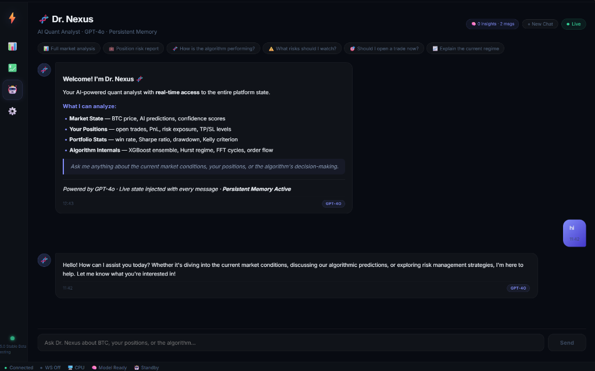
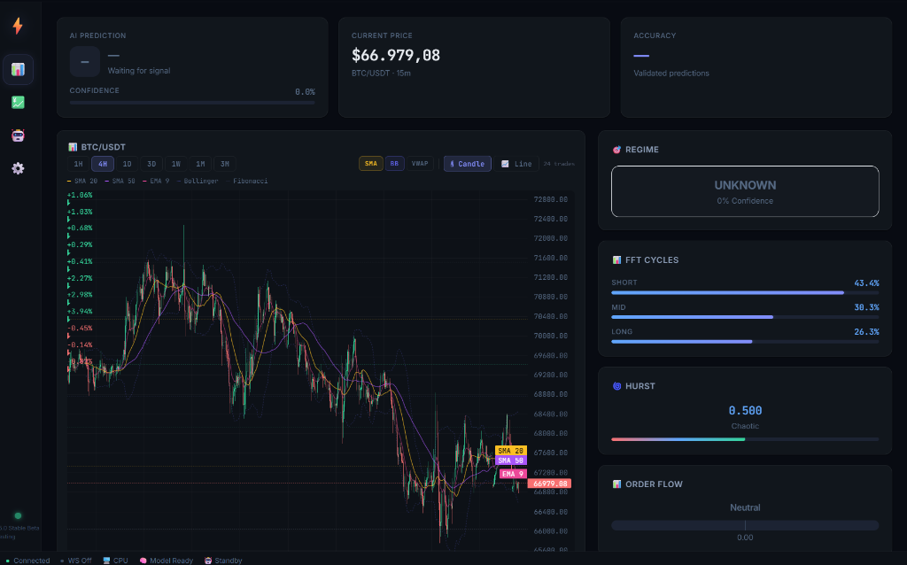

# 🧠 Brainstorming: Binance-Level UI & Real-Time Data

> **Date:** 2026-02-13  
> **Goal:** Elevate Nexus Shadow-Quant's UI to Binance trading-page quality

---

## Reference Screenshots

### Binance Trading Page — Order Book + Chart


### Binance Trading Page — News Headlines + Chart


---

## What Binance Does Right (and what we can adopt)

### 1. 📊 Chart Area
| Binance Feature | Our Current State | Action |
|---|---|---|
| Real-time candle growth | Static candles (1-min refresh) | ✅ Add via WebSocket tick aggregation |
| Multiple timeframes (1s, 1m, 15m, 1H, 4H, 1D, 1W) | 1m, 5m, 15m, 1H only | ✅ Add sub-minute from tick data |
| OHLCV overlay on hover | Basic hover via Plotly | ✅ Already decent, enhance styling |
| MA(7), MA(25), MA(99) overlays | Not shown | ✅ Add moving average overlays |
| Volume bars (colored buy/sell) | Basic volume | ✅ Color volume green/red by direction |
| TradingView integration | Custom Plotly chart | 🤔 Consider lightweight-charts (TradingView open-source) |

### 2. 💰 Price Header Bar
| Binance Feature | Our Current State | Action |
|---|---|---|
| Live price (sub-second) | 1-min delayed REST | ✅ WebSocket real-time |
| 24h Change % and $ | Not shown | ✅ Add to header/status bar |
| 24h High / Low | Not shown | ✅ Add to header |
| 24h Volume (BTC + USDT) | Not shown | ✅ Add to header |
| Price color (green = up, red = down) | Static color | ✅ Flash animation on tick |

### 3. 📰 News Headlines Panel
| Binance Feature | Our Current State | Action |
|---|---|---|
| BTC Headlines popup | NewsFeed component exists | ✅ Enhance styling, add timestamps |
| Category pills (Announcement, News) | Basic list | ✅ Add category tags |
| "View More" link | Shows all inline | ✅ Add expandable panel |
| Time-ago format ("23 minutes ago") | Basic timestamps | ✅ Use relative time |

### 4. 📖 Order Book (Left Panel)
| Binance Feature | Our Status | Action |
|---|---|---|
| Live order book (bid/ask) | NOT implemented | 🟡 Phase 2 — nice visual but complex |
| Color-coded depth | — | 🟡 Could show simplified depth |
| Spread display | Not shown | ✅ Easy from WebSocket |

### 5. 🎨 Design Language
| Binance Style | Our Style | Gap |
|---|---|---|
| Pure black background (#181A20) | Dark indigo (#080B12) | ✅ Very close already! |
| Yellow accent (#F0B90B) | Indigo accent (#6366F1) | Keep ours — more unique |
| Compact data density | More spacious | 🟡 Consider denser layout for dashboard |
| Monospace numbers | System font | ✅ Use monospace for prices/numbers |
| Green/Red for up/down | Green/Red | ✅ Already matching |

---

## Proposed Dashboard Redesign Layout

```
┌─────────────────────────────────────────────────────────────┐
│ ● ● ●  Nexus Shadow-Quant    BTC/USDT  $67,702.34 ▲ +2.34% │ ← Titlebar with live price
├─────────┬───────────────────────────────────────────────────┤
│         │  BTC $67,702.34  24h: +$64.33  H:$68,028  L:$65,118  Vol: 23,474 BTC │
│  Side   ├───────────────────────────────────────────────────┤
│  bar    │                                                   │
│         │              LIVE CANDLESTICK CHART                │
│ 🏠 Dash │         (TradingView lightweight-charts)           │
│ 📈 Trade│          Real-time candle growth                   │
│ 🤖 Agent│          MA(7) MA(25) MA(99) overlays             │
│ ⚙️ Set  │          Volume bars (green/red)                   │
│         │                                                   │
│         ├───────────────────────┬───────────────────────────┤
│         │   🎯 PREDICTION       │   📰 NEWS FEED            │
│         │   Direction: LONG ▲   │   • 23m ago: BTC Enters   │
│         │   Confidence: 72%     │     Capitulation Phase    │
│         │   Regime: TRENDING    │   • 1h ago: Spring Fest   │
│         │   Hurst: 0.67         │     Hashrate Boost        │
│         │   Next in: 45s        │   • 2h ago: ETF Inflows   │
│         ├───────────────────────┤     Hit $500M Record      │
│  UTC    │   📊 QUANT HUD        │                           │
│  15:59  │   RSI: 45.2  MACD: ▲ │   [View More →]           │
│         │   Vol: 0.023  ATR: 89 │                           │
└─────────┴───────────────────────┴───────────────────────────┘
│ ● Connected  │ CUDA:RTX5080 │ Model: 62.1% │ Bot: RUNNING  │ UTC 15:59:34 │
└─────────────────────────────────────────────────────────────┘
```

---

## Chart Library Upgrade Consideration

**Current:** Plotly.js (react-plotly.js)  
**Proposed:** TradingView Lightweight Charts (open-source)

| Criteria | Plotly.js | Lightweight Charts |
|---|---|---|
| Real-time updates | Heavy re-render | Native streaming API |
| Performance (10K+ candles) | Slow | Blazing fast (WebGL) |
| Financial chart features | Generic | Purpose-built for trading |
| Crosshair + OHLCV tooltip | Basic | Professional |
| Size | ~3.5 MB | ~45 KB |
| License | MIT | Apache 2.0 |
| Looks like Binance? | No | **YES** — it's literally what TradingView uses |

**Verdict:** Switch to `lightweight-charts` for the price chart. Keep Plotly for equity curve and other non-financial charts.

```bash
npm install lightweight-charts
```

---

## Priority Stack (what to build first)

1. 🔴 **WebSocket client** — foundation for everything
2. 🟡 **UTC Clock** — quick win, 30 min
3. 🟡 **Live price in titlebar/status** — depends on #1
4. 🟡 **Chart upgrade to lightweight-charts** — biggest visual impact
5. 🟡 **MA overlays + colored volume** — easy with new chart lib
6. 🟡 **Enhanced news feed** — category tags, relative time
7. 🟢 **Order book visualization** — nice to have
8. 🟢 **Monospace font for numbers** — quick CSS change
